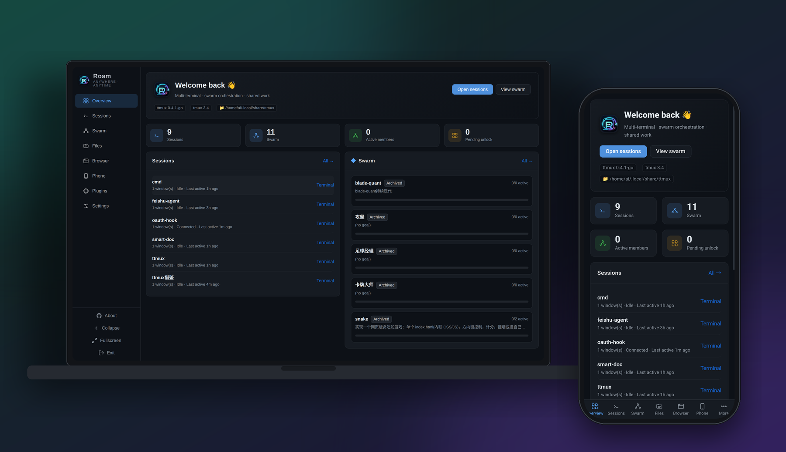
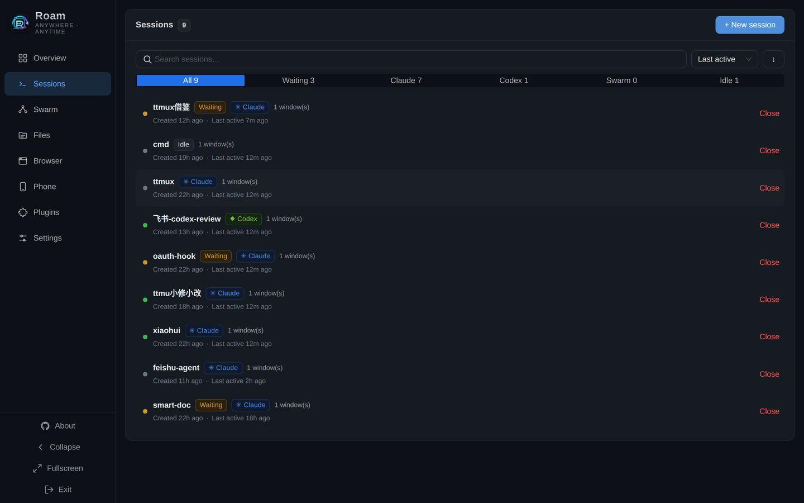
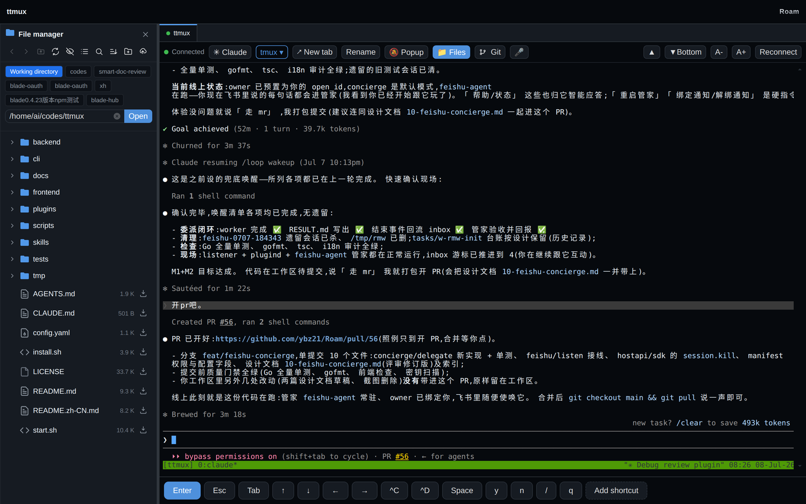
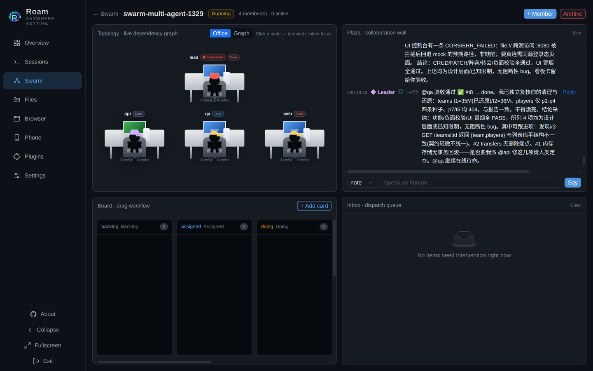
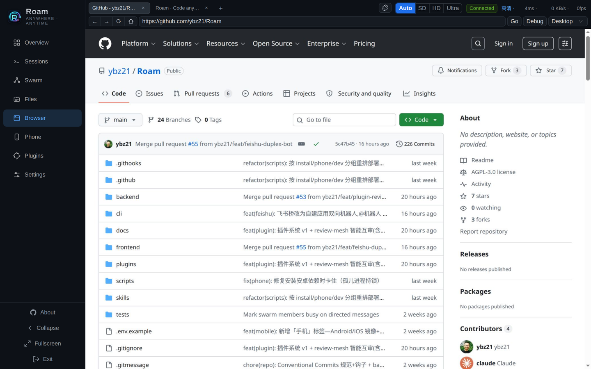
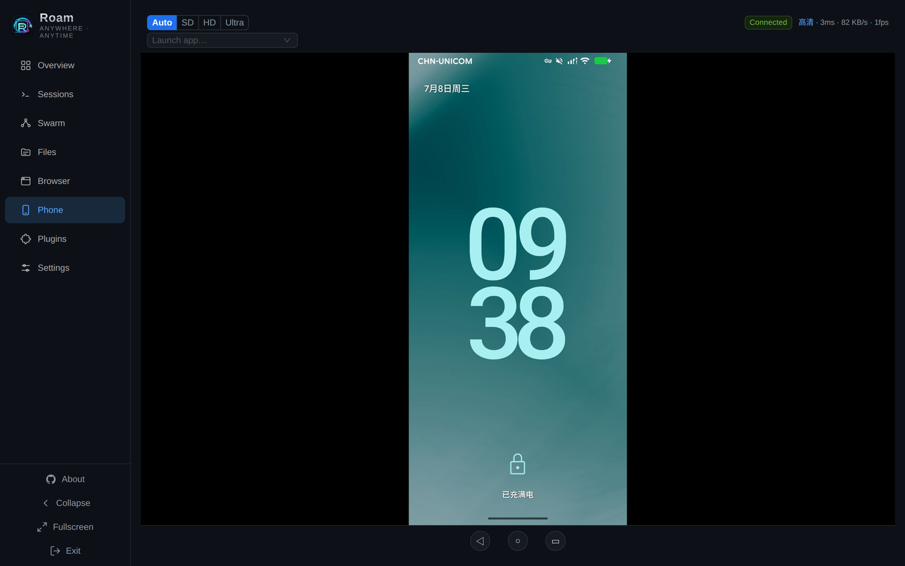
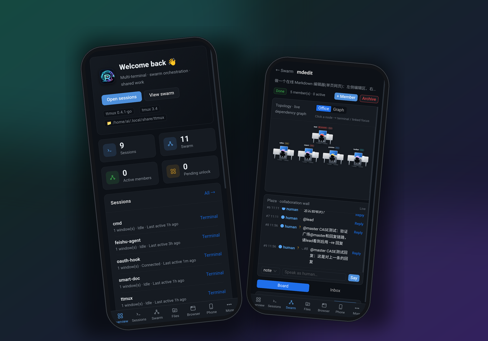
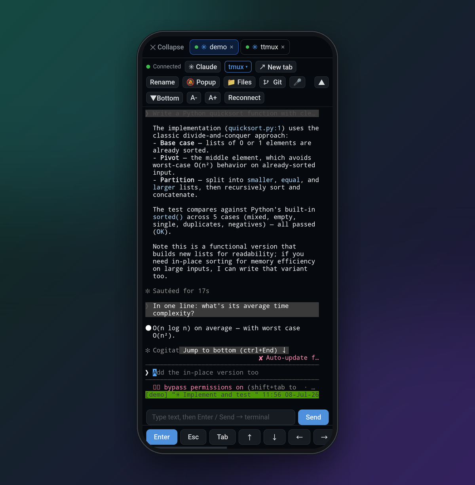

# Roam

**English** | [Simplified Chinese](README.zh-CN.md)

> **Turn your development machine into an always-on AI coding workstation.**

**Roam** lets you connect back to your own development machine from anywhere,
at any time, using a phone, tablet, or laptop. You can keep coding, run tests,
watch logs, debug in a browser, and supervise Claude Code, Codex, or other AI
coding agents while the real work continues on the development machine.

It solves a concrete problem: **complex development work should not be broken
apart by your device, network, or schedule.** Your code, terminals, dev
services, browser, and agents all keep running on the development machine. You
can switch devices, disconnect, leave your desk, and come back to the same
working scene. Unless you close them intentionally, the work on the development
machine does not disappear because a local terminal exited, a browser tab
closed, or a laptop lid shut.

**Roam at a glance:**

- **Remote development without losing the scene**: check progress from a phone,
  add instructions from a tablet, take over coding from a laptop, while the
  working context stays on the development machine.
- **Long tasks keep running**: tests, builds, migrations, logs, and debugging
  sessions survive lid closes, network drops, and device changes.
- **The workspace stays alive**: terminals, services, browser state, and agent
  conversations remain on the development machine unless you close them.
- **AI agents become manageable**: Claude Code, Codex, and other agents can be
  named, grouped, monitored, and given follow-up instructions.
- **Complex work can be orchestrated**: connect agents and tasks into a goal
  with dependencies, a board, and a shared message feed.

Roam is not another cloud IDE. It connects to your real development machine and
puts terminals, browser, files, tasks, and AI agents into a remotely controllable
workspace. What you see is a console; behind it is still the development
environment and toolchain you already use.



<sub>Remote access to one development machine: the desktop console and the phone show the same sessions, swarms, and live agent state.</sub>

## Core Capabilities

- **Close the lid, the work keeps running**: terminals, dev servers, tests, and
  agent conversations live on the development machine — a dropped network or a
  shut laptop never kills the scene.
- **Any device is the same desk**: open the Web console from a phone, tablet, or
  laptop and land back in the exact terminal you left — zero install, no native
  app to update.
- **Long tasks don't need you watching**: builds, migrations, log tailing, and
  agent runs keep going in the background; check back from anywhere to see where
  they got to.
- **Agents you can actually manage**: name, group, and track Claude Code, Codex,
  and others, collect their output, and drop in follow-up instructions without
  losing context.
- **Swarm splits one goal across many hands**: hand the API to one member, the
  frontend to another, tests to a third — a shared board and message feed keep
  them in sync, and dependencies unlock the next step automatically.
- **The debugging browser lives on the dev machine too**: login state,
  screenshots, and repro flows stay put, so remote UI debugging picks up right
  where it was.
- **Built for humans and agents to share one workspace**: take over from the Web
  console by hand, or let agents read state, collect output, and keep pushing.

## Screenshots

**Every session and agent in one list.** Filter by Claude / Codex / swarm or by
state (waiting, idle), see which agents need attention, and jump into any of them
as a terminal.



**One view for the agent, its terminal, and the file tree.** Watch Claude Code or
Codex work, browse and open files beside it, and type on the mobile key bar when
you're on a phone.



**Swarm, at a glance.** A live dependency topology of every member, a shared
collaboration wall (plaza), and a drag-to-flow board — so a complex goal split
across agents stays legible.



**Drive a real browser from the console.** The dev machine's Chrome is mirrored
into the console — open tabs, navigate, click, and type. Debug a web app, keep a
login session, or let an agent reproduce a flow, all on the development machine.



**Control a real phone from the console.** Mirror an Android device over adb — the
live screen, streaming stats, and remote nav bar — to reproduce mobile flows or
check an app right next to your terminals.



## Mobile: work from anywhere

**Your whole workspace fits in a phone.** Open the console in any mobile browser —
no app to install — and land back in the same sessions, swarms, and agents.
Check progress on the train, nudge an agent from the couch, take over from a café.



**Talk to an agent from your phone.** Open a session and chat with Claude Code or
Codex right in the terminal — the mobile key bar and send button let you type
follow-ups, review the reply, and keep the task moving without a laptop.



## Why It Exists

Remote development is easy for small tasks. Once the work becomes complex, it
starts to hit many breakpoints:

- dev servers need to keep running
- tests, logs, and builds need multiple terminals
- browser state matters for reproducing bugs
- agents need isolated context and follow-up instructions
- long tasks should keep running while you are offline
- you need to quickly understand what is still running

Roam treats the development machine as the single real working scene. The server
keeps work alive, and the Web console lets you reconnect from any device. When
automation is needed, scriptable interfaces expose sessions, tasks, logs, and
agent orchestration.

## Typical Use

1. Start Roam on your development machine.
2. Open the Web console from a phone, tablet, or another computer.
3. Enter an existing terminal and continue the previous working scene.
4. Let Claude Code, Codex, or another agent run long tasks on the development
   machine.
5. Leave the browser or close your local terminal; terminals, services, logs,
   and agents keep running on the development machine.
6. Come back later from any device to inspect progress, add instructions, or
   take over coding.

Roam is not mainly "one more terminal tool." It turns the development machine
into a continuously available workspace. The terminals, running services,
debugging browser, AI agent conversations, and task state on that machine do not
vanish just because a local device shut down, SSH disconnected, or a browser tab
closed.

## Install And Start

Install the CLI and build the Web console with one line:

```bash
curl -fsSL https://raw.githubusercontent.com/ybz21/ttmux/main/install.sh | bash
```

`install.sh` is a thin orchestrator over `scripts/`: it runs a system preflight
check, then three modules: **[1]** ttmux CLI + skills, **[2]** chrome + Node +
Playwright, and **[3]** backend build (frontend `dist` + Go binary). It installs
`ttmux` and `chrome` into `~/.local/bin` and builds the artifacts, but **does
not start any service**. When run through `curl | bash`, it fetches modules from
GitHub on demand; inside a clone, it sources the local modules directly.
`TTMUX_SKIP_BACKEND=1` installs only the CLI/chrome parts.

Then start the Web console from the repository:

```bash
cp .env.example .env
./start.sh             # start built artifacts directly, without recompiling
# ./start.sh --dev     # development mode: rebuild frontend + backend each run
```

`start.sh` also supports `stop` / `status` / `logs` / `fg`.

By default, the Web console listens on `0.0.0.0:13579`, so devices on the same
LAN can reach it. Before real use, change the access password in `.env`; for
remote access, prefer Tailscale, Cloudflare Tunnel, SSH forwarding, or frp.

Exposing Roam through **frp with HTTPS** so mobile voice input and clipboard
continue to work through the tunnel is covered in
**[docs/deploy/frp.md](docs/deploy/frp.md)** (bilingual).

Full installation, deployment, remote access, and command-line automation notes
live in **[docs/install/](docs/install/)**.

## For Claude Code / Codex

If Claude Code, Codex, or another command-line coding tool is installed on the
development machine, run it directly inside a persistent Roam terminal. Its
execution, output, context, and follow-up channel stay on the development
machine. When you return from a phone or tablet, you can inspect where it got to
and add more instructions.

For more complex work, Roam's swarm capability can split the goal across
multiple members: one can handle the API, one the frontend, one tests, and one
documentation. A shared board and message feed synchronize progress, and
dependencies unlock the next step when earlier work is done.

## Command Line And Automation

Roam also provides command-line entry points for scripts, automation, and AI
agents. This is not the main entry point for most users; start from the Web
console in most cases.

- `ttmux`: manages persistent sessions, background tasks, agent workers, swarms,
  and machine-readable state.
- `chrome`: drives Chrome on the development machine for UI debugging,
  screenshots, form flows, and automated validation.

Command details are intentionally not expanded on the home page, so the README
does not become a tool manual. When needed, see
**[docs/install/](docs/install/)**, `ttmux help`, and `chrome help`.

## Development And Contribution

Install the repository Git hooks once per clone:

```bash
bash scripts/dev/install-git-hooks.sh
```

The pre-commit hook runs the quick quality gate. CI runs the full gate on pushes
and pull requests:

```bash
scripts/dev/quality/check.sh quick
scripts/dev/quality/check.sh full
```

Build and run the Web console:

```bash
./start.sh --dev fg
```

Frontend only:

```bash
cd frontend
npm install
npm run dev
```

Backend only:

```bash
cd backend
TTMUX_BIN=../ttmux TTMUX_WEB_PASSWORD=dev go run ./cmd
```

CLI smoke test:

```bash
TTMUX=./ttmux bash tests/test_ttmux.sh
```

## Security Notes

Roam can control your development machine's terminal, files, browser, and
agents. Treat it as close to SSH access. For real deployments:

- Use a strong access password, and enable two-factor authentication when
  needed.
- Prefer Tailscale, Cloudflare Tunnel, SSH forwarding, or frp for external
  access.
- Do not expose the Web console port directly to the public Internet.
- Run it only on machines and accounts you trust.

## Docs

- [docs/install/](docs/install/) - installation and deployment
- [docs/design/](docs/design/) - design docs for swarm orchestration, plaza
  boards, and Web integration
- [backend/README.md](backend/README.md) - backend implementation details

## License

GNU Affero General Public License v3.0 (AGPL-3.0). See [LICENSE](LICENSE).
