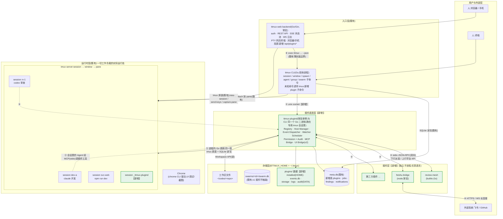
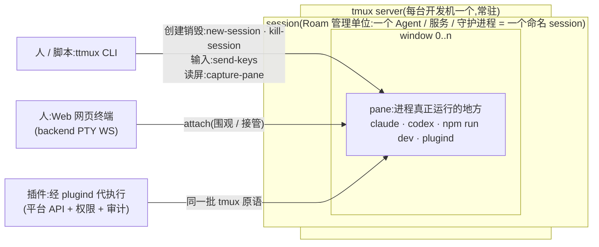
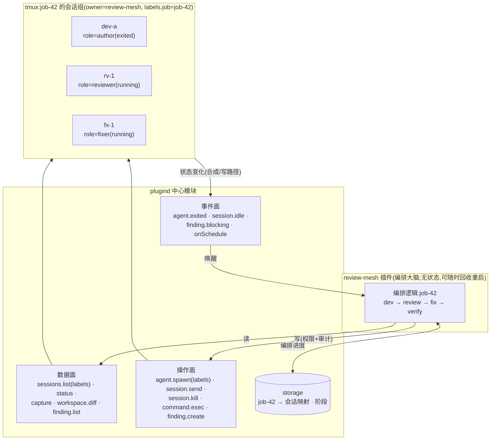
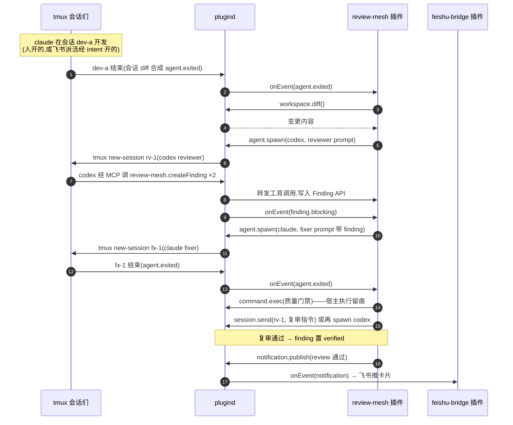
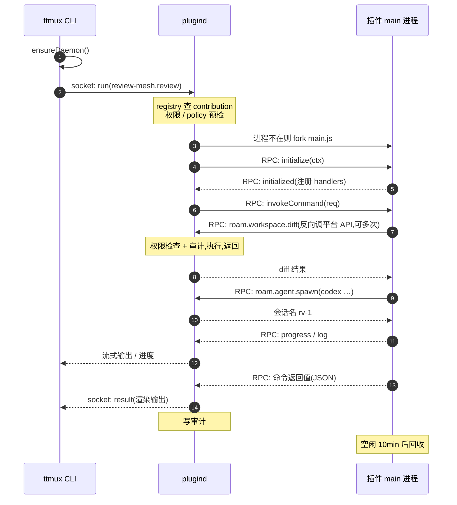
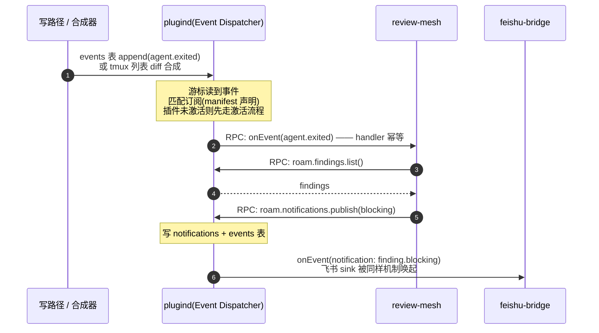
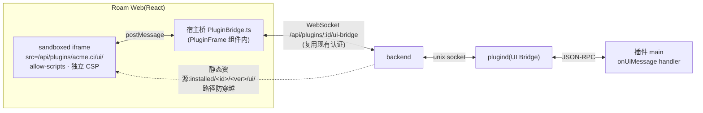
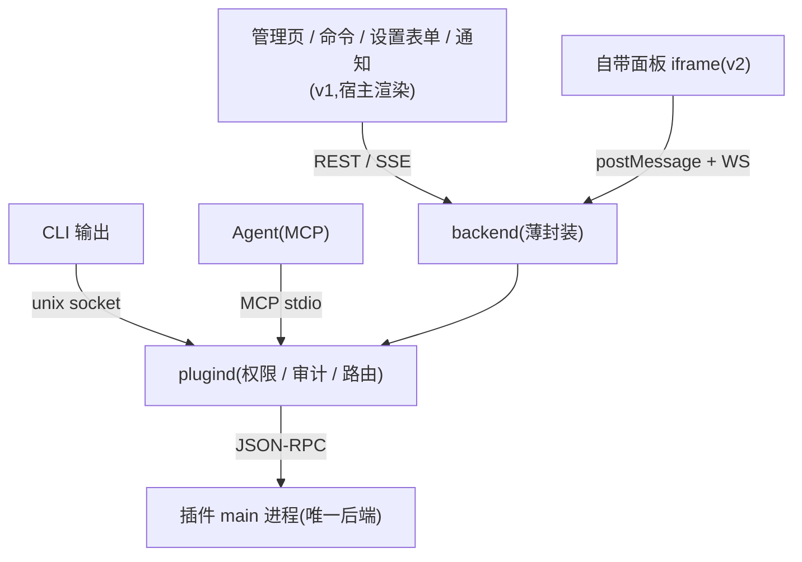
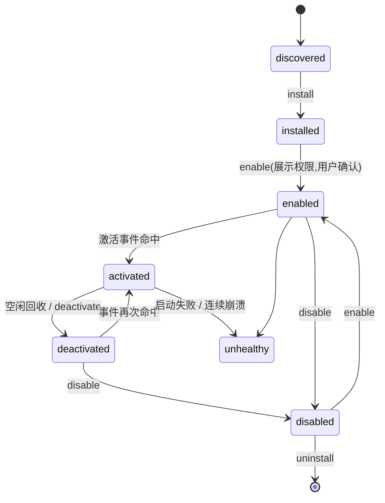

# 架构设计:全景、宿主进程、运行时序、前后端协同与集成

> 返回 [插件机制设计主文档](README.md)
>
> 本篇是整个插件机制的核心。第 2 节先给出**整个系统的分层全景**:既有系统(CLI、backend server、tmux 会话/窗口/面板、存储)长什么样、插件子系统作为"夹层"插在哪里、各层之间怎么通信、插件如何串联会话;之后逐层展开:插件由什么组成、宿主进程挂在哪、后端如何运作、事件从哪里来、前端如何展示、代码集成到哪些文件夹。

## 1. 现状约束(设计必须承认的事实)

| 事实 | 证据 | 对设计的影响 |
|---|---|---|
| `ttmux` CLI 是短命进程,命令执行完即退出 | `cli/ttmux-cli-go/internal/app/app.go` 手写 switch 分发,无常驻循环 | CLI 无法承载 watcher、事件订阅、常驻插件进程 |
| 唯一常驻进程是 `ttmux-web` backend(Go/Gin),但它与 CLI 之间是**子进程 exec 边界** | `backend/ttmux/client.go:20-27`,注释明确"唯一接触子进程的地方" | 插件宿主不能塞进 backend,否则纯 CLI 用户(不开 Web)没有插件能力,且破坏"Web 是 CLI 薄封装"原则 |
| **代码里没有任何事件总线**;状态流转 = 显式命令写 SQLite + 依赖解锁扫描 + 10s 轮询 listener + 往 tmux 会话注入文字 | `internal/command/swarm/swarm.go:244-268`、`listener.go:79-83`、`plaza.go:115-137` | "订阅事件"必须自己造;v1 用事件日志 + 游标,不假装有实时总线 |
| 存储是 SQLite(纯 Go 驱动 modernc.org/sqlite,无 CGO) | `internal/swarm/store.go:13-15`、`go.mod` | 插件注册表、事件日志复用同一套存储,不新引 JSON 全局文件(多进程写竞争) |
| 数据根目录是 `$TTMUX_HOME`,默认 `~/.ttmux` | `internal/runtime/runtime.go:28`、`internal/swarm/swarm.go:66-69` | 插件全部数据落在 `~/.ttmux/plugins/`,注册表进 `~/.ttmux/meta.db` |
| Agent 拉起是硬编码 claude/codex 两分支拼 shell | `internal/command/spawn/agent.go:40-44` | Agent Provider 抽象需要一笔前置重构(见 [08-roadmap.md](08-roadmap.md) 阶段 2) |
| 长驻工作负载的既有习惯是"跑在 tmux 会话里"(如 `swarm listen`) | listener 即为 tmux 内长循环 | 插件守护进程沿用该习惯,可见、可 attach、可被 ttmux 自己管理 |
| 前端是 React + AntD 单页应用,按功能组件分块,统一 `api.ts` 封装,i18n 在 `frontend/src/i18n/locales/{zh-CN,en-US}.ts` | `frontend/src/App.tsx`、`frontend/src/api.ts` | 插件管理页/设置表单作为新组件接入 App;宿主外壳文案进 locales |

## 2. 整体架构全景

### 2.1 系统分层总图:既有系统 + 插件子系统

整个系统分六层。**绿色为插件机制新增部分,其余全部是既有系统**——插件子系统是夹在入口层与运行时层之间的一个"夹层",不替换任何既有链路:人直接用 CLI 管会话、Web 直接 PTY 连终端的老路完全不变,插件只是多出一条经 plugind 的自动化通路。



### 2.2 各层职责

| 层 | 组成 | 既有 / 新增 | 职责 |
|---|---|---|---|
| 用户与外部层 | 终端、浏览器/手机、飞书/GitHub | 既有;外部系统入口随插件新增 | 发起操作、接收结果 |
| 入口层 | `ttmux` CLI;`ttmux-web` backend(auth/REST/SSE/WS 日志/PTY/投屏) | 既有;各自只加一个 plugin 子命令 / 一组 `/api/plugins*` 路由 | 人机接口;backend 始终是 CLI 的薄封装,不含业务逻辑 |
| 插件底座层 | `ttmux-plugind` | **新增** | 插件注册、进程托管、事件分发、watcher 调度、权限+审计、MCP 桥;**平台 API 的唯一实现处** |
| 插件层 | 各插件子进程 | **新增** | 编排逻辑:命令 handler、事件响应、外部系统对接;不直接碰下两层 |
| 运行时层 | tmux server(session→window→pane)、Chrome | 既有;仅新增 `_ttmux-plugind` 一个会话 | 一切工作负载的实际运行处:Agent、开发服务、守护进程都是 tmux 会话 |
| 存储层 | meta.db、swarm.db、`plugins/`、工作区文件 | 既有 + 新增表/目录 | 状态、事件日志、插件数据、审计;SQLite 是所有进程的状态汇聚点 |

### 2.3 运行时层的对象模型:CLI、会话、窗口、面板的关系

tmux 的对象层级是 `server → session → window → pane`;**Roam 以 session 为唯一管理粒度**——spawn 一个 Agent、起一个开发服务、跑一个守护进程,都是开一个命名 session;window/pane 是 tmux 的内层结构,Roam 命令默认作用于 session 的活动 pane(`ttmux` 未知命令透传 tmux,高级用户仍可直接操作 window/pane)。



这个对象模型被平台 API **原样继承**:`agent.spawn` = new-session、`session.send` = send-keys、`session.capture` = capture-pane。所以**插件看到的"会话"就是人看到的会话**——同一个 tmux 对象,三种操作者(人经 CLI、人经网页终端、插件经 plugind),这正是"插件编排的工作人随时可以 attach 插手"的原因;区别只在于插件这条路每一步都要过权限和审计。

### 2.4 全部通信通路(编号对应 2.1 图中箭头)

| # | 通路 | 协议/机制 | 用途 |
|---|---|---|---|
| ① | **CLI → plugind**(仅 CLI;backend 不直连,见⑥) | unix socket(JSON) | 插件管理(ls/enable/...)、命令调用(`plugin run`)、状态查询 |
| ② | plugind ↔ 插件子进程 | **stdio 上的 JSON-RPC,双向** | 下行:派发命令/事件/工具调用/UI 消息;上行:插件反调平台 API(`roam.agent.spawn`、`roam.session.capture`…) |
| ③ | Agent(tmux 会话里的 claude/codex)→ plugind | MCP over stdio(`ttmux plugin mcp`) | Agent 调用插件贡献的工具(如写回结构化 finding) |
| ④ | 插件 → 外部系统 | 插件进程自行 HTTPS/WS(飞书长连接、GitHub API) | 外部消息进出;入站一律转 Command Intent 才可执行 |
| ⑤ | plugind → 运行时/存储层 | **进程内 Go 调用**(同一二进制,直接复用 `internal/swarm`、`internal/runtime` 的 Tmux/Store) | 把平台 API 落成 tmux 原语与 SQLite 读写,见 2.5 |
| ⑥ | backend → CLI | 子进程 exec(既有边界,`backend/ttmux/client.go`) | **v1 中 backend 对插件的所有操作只走 `ttmux plugin ... --json`**,保持薄封装;唯一例外是 v2 的 UI Bridge(8.2 节),届时 backend 为转发 iframe 消息直连 plugind socket |

三条铁律,整个架构就立在这上面:

1. **插件永远不直接碰运行时层和存储层**——不 exec tmux、不开 meta.db、不拼 claude 命令行;对 Roam 的一切读写都走②的平台 API,由 plugind 代执行(⑤),因此每次操作都有权限检查和审计。
2. **plugind 是唯一的"翻译器"**——它与 CLI 同一个 Go 二进制,直接 import 现有 internal 包操作 tmux 和 SQLite,不需要再 exec 一层 ttmux;平台 API ↔ Roam 原语的对应关系集中在一处。
3. **插件之间不直连**——级联全靠事件(A 发通知 → 事件日志 → B 被唤醒),每一跳都可审计、可禁用。

### 2.5 一个插件如何拿到多个会话并组织它们

#### 2.5.1 核心机制:标签化的会话句柄

插件手里没有 PTY、没有子进程——它"持有"一个会话的方式,就是**知道会话的名字和元数据**。plugind 在 spawn 时给会话记录归属(owner)和标签(labels),插件随时用过滤条件把属于自己的一组会话取回来:

```js
// 拉起时打标:这个会话属于我的 job-42,角色是 reviewer
await ctx.agents.spawn({
  provider: 'codex', sessionName: 'rv-1',
  prompt: reviewerPrompt,
  labels: { job: 'job-42', role: 'reviewer' }
})

// 之后任何时刻(哪怕插件进程被回收又重启):取回 job-42 的整组会话
const group = await ctx.sessions.list({ owner: 'self', labels: { job: 'job-42' } })
// -> [ { name:'dev-a', labels:{role:'author'},   status:'exited'  },
//      { name:'rv-1',  labels:{role:'reviewer'}, status:'running' },
//      { name:'fx-1',  labels:{role:'fixer'},    status:'running' } ]
```

- **owner**:plugind 注册表记录每个会话由哪个插件创建。`owner:'self'` 只取自己的;监控类插件可申请 `sessions:read` 读全部会话(含人手工开的)。
- **跨激活恢复**:插件进程随时可能被空闲回收,但会话活在 tmux 里不受影响。编排进度(job → 会话名 → 阶段)存 `ctx.storage`;插件被事件再次唤醒后,`sessions.list` + storage 对账即可接着编排,这就是插件"无状态编排"的基础。
- **禁用语义**:插件被禁用时,它创建的会话默认**保留**(活可能还在干,人可以接管);`ttmux plugin disable <id> --kill-sessions` 或 policy 可选择级联清理。

#### 2.5.2 中心模块(plugind)提供的三面接口

插件组织多个会话时,plugind 提供的能力分三面——**数据面(读)、操作面(写)、事件面(推送)**,全部经通路②,每次调用都过 Permission + Audit:

**数据面——插件"看"会话组和上下文**:

| 接口 | plugind 内部落点 | 权限 | 编排中的用途 |
|---|---|---|---|
| `sessions.list({owner, labels, status})` | 注册表(owner/labels)+ `tmux list-sessions` 合并 | `sessions:read` | **拿到自己的一组会话**,对账编排状态 |
| `session.status({name})` | tmux 存活 + 注册表元数据 | `sessions:read` | 判断某步是否完成/崩溃 |
| `session.capture({name, tailLines})` | `tmux capture-pane` | `sessions:read` | 看 Agent 输出,判断卡住/提取结果 |
| `agent.providers()` | Agent Provider Registry | — | 发现 claude/codex 可用性再决定派谁 |
| `workspace.diff/files/readFile` | git / 文件系统(防穿越) | `workspace:read` | 取任务上下文喂给 Agent |
| `finding.list` / `storage.get` / `config.get` | meta.db / 插件私有存储 | 相应权限 | 读回结构化结果与自己的编排进度 |

**操作面——插件"动"会话组**:

| 接口 | plugind 落到的 Roam 原语(经⑤) | 权限 |
|---|---|---|
| `agent.spawn({provider, prompt, sessionName, labels})` | 复用 spawn 包拼 claude/codex 命令 → `tmux new-session` → 注册表记 owner/labels → events 记 `agent.spawned` | `agents:spawn` |
| `session.send({name, text})` | `tmux send-keys`(向运行中的 Agent 追加指令) | `sessions:write` + policy |
| `session.kill({name})` | `tmux kill-session` | `sessions:write` + policy |
| `command.exec({argv, cwd})` | 宿主起子进程执行白名单命令,输出与 exit code 留痕 | `commands` 白名单 |
| `finding.create/update/verify` | meta.db 写入 + events | `findings:write` |
| `notification.publish` | 通知流(Web/CLI/飞书 sink 可见) | `notifications:publish` |
| `watcher.register` | 持久调度器 | `watchers:register` |

**事件面——会话组的状态变化反过来唤醒插件**(订阅在 manifest 声明,支持按 label 过滤):

| 事件 | 来源(见第 6 节) | 编排中的用途 |
|---|---|---|
| `agent.exited` / `session.exited` | events 表 + 会话列表 diff | 一步完成,推进到下一步 |
| `session.idle` | 输出指纹合成 | Agent 卡住/等确认,触发干预 |
| `finding.blocking` / `notification.*` | 写路径 | 结构化结果驱动分支(如拉起 fixer) |
| `watcher.alert` / `onSchedule` | 调度器 | 无事件时的定时对账兜底 |

一个插件的编排循环因此是纯反应式的:**事件唤醒 → 数据面对账(list + capture + storage)→ 操作面推进一步(spawn / send / exec)→ 进度写回 storage → 进程被回收**。状态在 plugind 和 tmux 里,插件本身随时可丢、可重启。

#### 2.5.3 结构图:一个插件 × 一组会话



**端到端编排示例:一个插件串联 claude 与 codex 互审**(review-mesh,全部动作都在上面三面接口之内):



注意每一步的性质:**插件是编排大脑,plugind 是手,tmux 会话是工作台**。会话全是普通 ttmux 会话——人随时 `ttmux attach rv-1` 插手围观或接管;插件的每次 spawn/send/exec 都有权限检查与审计记录;插件崩了,会话还在,状态在 meta.db 里,重新激活后从 finding/事件接着编排。

### 2.6 分阶段架构切片:别被全景图拖大第一版

2.1 的全景是**目标态**。实现按切片推进,每个切片单独可交付(与 [08-roadmap.md](08-roadmap.md) 阶段对应):

| plugind 模块 / 能力 | MVP-A(hello,阶段 1) | MVP-B(review-lite,阶段 2) | v1.5(阶段 3) | v2+ |
|---|:-:|:-:|:-:|:-:|
| Registry + manifest + `plugin` 子命令 | ✅ | ✅ | ✅ | ✅ |
| Host Manager + JSON-RPC + `commands` | ✅ | ✅ | ✅ | ✅ |
| Audit | ✅(命令留痕) | ✅ | ✅ | ✅ |
| unix socket + ensureDaemon | ✅ | ✅ | ✅ | ✅ |
| Event Dispatcher(events.db + 合成) | — | ✅ | ✅ | ✅ |
| Watcher Scheduler | — | ✅ | ✅ | ✅ |
| Agent Provider / Session / Workspace API | — | ✅ | ✅ | ✅ |
| Finding / Notification / Job API | — | ✅ | ✅ | ✅ |
| MCP Bridge | — | ✅ | ✅ | ✅ |
| Permission(宿主 API 侧强制)+ policy 文件 | 最小(命令白名单) | ✅ | ✅ | ✅ |
| Secret / Webhook / Intent / Approval / SCM | — | — | ✅ | ✅ |
| UI Bridge + views(iframe) | — | — | — | ✅ |
| Swarm 事件与 hooks | — | — | — | 阶段 5 |

MVP-A 的 plugind 只有四个模块(Registry、Host Manager、Audit、socket),一张全景图里 80% 的框在第一个可合并版本里**不存在**——实现团队以本表为准,不以 2.1 为准。

## 3. 插件由什么组成:后端进程为主体,前端可选

一个插件 = **一个后端进程(必有) + 配置 schema(可选) + Web UI 静态资源(可选,v2)**。

开发态与安装态的完整目录:

```text
my-plugin/                        # 开发仓库
├── roam-plugin.json              # manifest:身份、权限、贡献点、激活条件
├── README.md
├── package.json                  # 依赖 @roam/plugin-sdk(Node 插件)
├── schemas/
│   └── config.schema.json        # 可选:宿主自动渲染设置表单,插件不写前端
├── src/
│   ├── main.ts                   # 【主体】后端进程源码(此为 Node SDK 形态的示例,
│   │                             #  语言不限,见下文"插件用什么语言写")
│   └── ui/                       # 可选(v2):自带面板源码(任意前端栈,构建成静态文件)
│       ├── index.html
│       └── panel.tsx
└── dist/                         # 构建产物 = 实际分发内容
    ├── main.js                   # 后端进程入口,plugind 按需拉起,JSON-RPC over stdio
    └── ui/                       # v2:iframe 里加载的纯静态资源(无构建服务)
        ├── index.html
        └── assets/...
```

安装后落在 `~/.ttmux/plugins/installed/<id>/<version>/`(内容即 dist + manifest + schemas)。

- **v1 不支持纯前端运行时插件**:任何运行时能力(哪怕只是展示)都需要 `main` 作为数据来源和权限主体;`dist/ui` 只是 `main` 的展示层。后续可考虑"纯 manifest 插件"(无 `main`,只贡献命令别名、配置 preset、文档入口等静态声明),不在 v1 范围。
- **纯后端插件是 v1 主流**:飞书消息插件就是一个没有任何页面的后端程序——常驻订阅 Roam 通知、调飞书 OpenAPI 发卡片、接收回调转成受控命令;它的"设置界面"由宿主根据 config schema 自动渲染。

**插件用什么语言写?——协议语言无关,分三种形态**:

| `runtime.kind` | 谁用 | 说明 |
|---|---|---|
| `builtin` | **内置官方插件(review-mesh、monitor)用 Go 写** | 编译进 ttmux 单二进制,plugind 以隐藏子命令(`ttmux _plugin-host <id>`)拉起自身作为插件子进程;保持"Go 单二进制、零 Node 依赖"的安装体验,内置插件不给 ttmux 引入任何新运行时 |
| `node` | 第三方生态主推形态 | 官方 `@roam/plugin-sdk`;用 TS 还是 JS 开发随意(示例中的 `src/main.ts` 即 TS 源码),**分发和运行的是构建后的 `dist/main.js`**;仅安装了 Node 插件的用户机器需要 Node |
| `exec` | 任意语言 | Python/Go/Rust 均可,自带可执行文件/解释器,直接实现 stdio 上的 JSON-RPC 即可 |

三种形态在 plugind 眼里完全一致:都是"一个子进程 + stdio JSON-RPC",权限、审计、生命周期无差别。

**业界先例(为什么这是主流做法)**:子进程 + stdio JSON-RPC 是 LSP(VS Code 与所有语言服务器)和 MCP(claude/codex 工具协议)的既有选择;Go 宿主 + 子进程 RPC 是 HashiCorp go-plugin(Terraform/Vault/Nomad)确立的 Go 生态事实标准——Go 自带的进程内 `plugin` 包因平台与版本锁死几乎无人生产使用;"内置插件与第三方插件走同一协议、官方实现编译进主二进制"参照 Terraform 内置 provider;"任意语言可执行文件即插件"参照 Docker CLI plugins 与 kubectl krew。同进程加载(VS Code extension host、IntelliJ classloader)只在宿主与插件共享语言运行时时成立,不适用于 Go 宿主。

## 4. 进程模型:ttmux-plugind

### 4.1 为什么需要一个新守护进程

watcher 调度、事件订阅、notification sink、飞书长连接都要求**常驻**。CLI 是短命的;backend 不一定开;所以引入单例守护进程 `ttmux-plugind`(编译进 ttmux 二进制,`ttmux plugin daemon` 子命令启动),它是插件机制的唯一常驻宿主:

```text
ttmux-plugind 职责
├── Plugin Registry      读 manifest,维护注册表与 contribution 索引(存 meta.db)
├── Host Manager         按激活事件拉起/停止插件子进程,维护 JSON-RPC 连接与健康状态
├── Event Dispatcher     消费事件日志,合成 session 事件,按订阅分发给插件
├── Watcher Scheduler    持久定时任务,plugind 重启后从注册表恢复
├── Permission + Audit   校验每次宿主 API 调用,写审计 JSONL
├── MCP Bridge           把已启用插件的 agentTools 聚合成一个 MCP server
├── UI Bridge(v2)      转发插件面板 iframe 与插件 main 之间的消息
└── Control API          unix socket($XDG_RUNTIME_DIR/ttmux/plugin.sock),供 CLI 调用
                         (backend 不直连;仅 v2 UI Bridge 例外)
```

### 4.2 启动与单例

- **托管方式**:plugind 运行在专用 tmux 会话(如 `_ttmux-plugind`)里,沿用项目"长驻负载进 tmux"的习惯——可见、可 attach 看日志、跟随 tmux server 生存。
- **按需拉起**:任何 `ttmux plugin ...` 命令、backend 启动、以及 `start-all` 都执行 `ensureDaemon()`。因为 plugind 跑在 tmux 会话里,tmux server 重启后可能出现"socket 文件还在、进程已死"的残留,健康判定必须按固定顺序:

  ```text
  connect socket → ping(带协议版本)→ 成功即返回
    ↳ 失败:pid 文件校验 + tmux 会话存在性校验
    ↳ 双死:清理 stale socket/pid → 取文件锁(带冷却)→ spawn 新 daemon → 等待 ping 通过
  ```

- **防重入**:上述 spawn 必须在文件锁内串行 + 冷却。项目在 ensureChrome 上吃过无防重入狂拉进程的亏,这里从第一天就做。
- **降级语义**:plugind 未运行时,`ttmux plugin run` 仍可工作(ensure 后执行);事件驱动与 watcher 能力仅在 plugind 存活期间有效,`ttmux plugin status` 明确展示守护进程健康状态。

### 4.3 插件子进程

- 每个激活的插件是 plugind 的一个子进程,stdio 承载 JSON-RPC。**协议帧采用 LSP 式 `Content-Length` framing**(而非裸换行 JSON):这让"依赖库偷偷 console.log 到 stdout"可被检测——帧边界外的字节按协议错误计数,超过阈值(如 3 次)标记 unhealthy 并写审计,而不是静默解析错乱。Node SDK 在 `initialize` 前把 `console.log/info` patch 到 stderr,插件日志一律走 stderr,由 plugind 收集到 `plugins/logs/<id>.log`。
- 同一插件多个激活事件命中只启动一个进程;空闲超时(默认 10 分钟,可配)后 `deactivate` 回收。声明 `runtime.resident: true` 的常驻型插件(如维持飞书长连接的桥接插件)不参与空闲回收,随 plugind 启停。
- 插件崩溃不影响 plugind;连续崩溃(如 3 次/10 分钟)标记 `unhealthy` 并停止拉起,写审计。
- 激活超时默认 **10s**(可配;Node 冷启动在低配开发机上 5s 不够)。

## 5. 插件后端如何运作:两条完整时序

插件 `main` 进程是一个**被动的 RPC 服务**:被 plugind 拉起 → 注册 handler → 等待宿主派发(命令/事件/工具调用/UI 消息)→ handler 里反向调用平台 API 干活 → 空闲即被回收。它自己不轮询、不守端口、不开后台任务。

### 5.1 时序一:用户(或 Web/Agent)调一个插件命令

以 `ttmux plugin run review-mesh.review` 为例:



要点:

- **同一个入口服务三方**:Web 的 `POST /api/plugins/:id/invoke` 与 Agent 的 MCP 工具调用,进 plugind 后走的是完全相同的"权限预检 → invoke → 反向 API → 审计"路径,只是发起方标识(actor)不同。
- 命令是**短事务**:handler 内不允许长驻;长活(如一次 review 会话)通过 `agent.spawn` 变成 ttmux 会话,handler 立即返回会话名,后续靠事件收尾。
- 返回值是结构化 JSON:CLI 渲染成文本,Web 直接展示,Agent 原样消费。

### 5.2 时序二:一个事件驱动的自动化

以 review-mesh 订阅 `agent.exited` 为例:



事件在插件之间**级联但不直连**:review-mesh 发布通知 → 落事件日志 → dispatcher 唤起订阅了 `onNotification` 的飞书插件。插件之间没有任何直接调用,全部经宿主中转,因此每一跳都有权限与审计。

## 6. 事件模型:事件日志 + 游标,而不是假想的实时总线

### 6.1 事件从哪里来

v1 事件有两个来源,**都诚实标注延迟语义**:

**① 写路径同步落事件(准实时)**。在 CLI/宿主的状态写入点,向事件日志库(`$TTMUX_DATA/plugins/events.db`,与业务状态分库,见第 10 节)的追加式 `events` 表写一条记录:

```sql
CREATE TABLE events (
  id      INTEGER PRIMARY KEY AUTOINCREMENT,
  ts      TEXT NOT NULL,
  type    TEXT NOT NULL,   -- 如 agent.spawned / finding.created / notification.published
  source  TEXT NOT NULL,   -- cli / plugind / plugin:<id>
  subject TEXT,            -- session 名、finding id 等
  payload TEXT             -- JSON
);
```

覆盖:`ttmux spawn/agent` 的拉起与结束回调、Finding API 写入、Notification 发布、approval 决策、插件生命周期变化。CLI 进程写完即退出,plugind 以游标(last id)消费,轮询间隔 500ms 级(SQLite 单表游标查询,代价可忽略),后续可用文件 watch 加速。

**② plugind 合成事件(轮询 diff,秒级延迟)**。session 的创建/退出/静默没有可靠的写路径(tmux pane_dead 钩子在实践中几乎不触发),由 plugind 周期性(默认 2s)对比 `tmux list-sessions` / capture 结果合成:

- `session.created` / `session.exited`:会话列表 diff。
- `session.idle`:输出指纹在阈值时间内未变化。
- `agent.exited`:agent 会话(按命名约定/registry 标记)退出。

### 6.2 事件类型(v1,不含 swarm)

| 事件 | 来源 | 延迟 |
|---|---|---|
| `session.created` / `session.exited` / `session.idle` | 合成 | ~2s |
| `agent.spawned` / `agent.exited` | 写路径 + 合成兜底 | 准实时 ~ 2s |
| `finding.created` / `finding.updated` / `finding.blocking` | 写路径(Finding API) | 准实时 |
| `notification.published` / `notification.acked` | 写路径 | 准实时 |
| `watcher.alert` | plugind 内部 | 实时 |
| `approval.requested` / `approval.decided` | 写路径 | 准实时 |
| `plugin.activated` / `plugin.unhealthy` 等生命周期 | plugind 内部 | 实时 |
| `swarm.*` | — | **阶段 5,v1 不提供** |

约束:事件是**至少一次**投递,插件 handler 必须幂等;事件日志按大小/天数滚动清理;订阅由 manifest 声明(`onSessionEvent:` / `onNotification:` 等),plugind 只把事件派给声明过且已启用的插件。

### 6.3 为什么不直接做实时总线

现状所有状态变更散布在"CLI 命令、Web exec CLI、Agent 自己跑 CLI"三条路径上,都以 SQLite 为汇聚点。以 DB 为事件源(而不是在每条路径上插桩内存总线)是唯一不会漏事件的做法;代价是秒级延迟,对本机自动化场景完全够用。升级到推送(fsnotify / socket 广播)不改变插件侧 API。

## 7. CLI 与 Agent 如何接入

### 7.1 CLI

`ttmux plugin ...` 子命令(新增 `internal/command/plugin/` 包,不侵入现有命令;注意 `app.go` 的 default 分支会把未知命令透传 tmux,`plugin` 必须显式注册):

- 管理类(ls/info/enable/...):经 unix socket 调 plugind;plugind 未起时读 meta.db 降级完成只读操作。
- `ttmux plugin run <command-id>`:走 5.1 的完整时序。
- `ttmux plugin dev ...`:开发者工具,见 [09-plugin-development.md](09-plugin-development.md)。

### 7.2 Agent(claude / codex)

**用 MCP,不自造 tool 协议**。plugind 内置 MCP Bridge,把所有已启用插件的 `agentTools` 聚合为一个 MCP server(`ttmux plugin mcp` 提供 stdio 入口,注册到 claude/codex 的 MCP 配置):

```text
claude ──MCP(stdio)──> ttmux plugin mcp ──socket──> plugind ──RPC──> 插件 handler
```

- Agent 看到的工具名:`<pluginId>.<toolId>`(如 `review-mesh.createFinding`),带 manifest 里的 description/schema。
- Agent 调用与人类调用走同一条权限、审计链,不因自动化而绕过;插件启停后,MCP 工具列表同步变化。
- 这解决了"reviewer agent 如何写回结构化 finding":不解析聊天文本,Agent 直接调插件工具。

## 8. 前端展示与前后端协同

插件在 Roam Web 里的展示分两级:**v1 全部由宿主前端渲染,插件零前端代码;v2 才允许插件自带 iframe 面板**。无论哪级,链路都是 `前端 → backend → CLI/socket → plugind → 插件 main`,插件 main 永远是数据与权限的唯一后端。

### 8.1 v1:宿主渲染,插件零前端

插件能力出现在四个现成的展示面上,全部走 backend 的薄封装 REST(exec `ttmux plugin ... --json`):

| 展示面 | 前端来源 | 数据链路 |
|---|---|---|
| 插件管理页(列表/启停/权限/审计) | 新组件 `PluginsPanel.tsx`,AntD 表格/描述 | `GET /api/plugins` → exec `plugin ls --json` |
| 命令调用(命令面板/详情页按钮) | manifest `contributes.commands` 的 locale title 渲染成按钮 | `POST /api/plugins/:id/invoke` → exec `plugin run <cmd> --json`,结构化 JSON 返回后由通用结果组件展示 |
| **设置表单(这就是"插件的设置界面")** | 宿主用 `config.schema.json` 自动生成 AntD 表单(标题/描述取 schema 的 locale 字段) | `GET /api/plugins/:id/config`(schema+当前值)/ `PUT /api/plugins/:id/config`;保存后插件收到 `config.changed` 事件 |
| 通知流 | 现有 SSE 状态快照(`backend/stream/`,2s 轮询)新增 notifications 切片 | 插件 `notification.publish` → meta.db → SSE 快照 → 前端通知中心/角标 |

协同要点:

- **长任务的展示**不靠 invoke 挂着连接:插件把长活转成 Agent/tmux 会话或 finding/notification,前端复用现成的会话终端(`Terminal.tsx`/PTY WS)和通知流看进度。invoke 本身始终是短请求。
- 前端**不感知 plugind 的存在**:它只认识 backend 的 REST/SSE;plugind 挂了,管理页照常渲染(降级读 meta.db),事件类能力显示为不可用(`plugin status` 数据里带健康位)。
- 宿主外壳文案(管理页、授权对话框、审计页)按项目 i18n 标准进 `frontend/src/i18n/locales/{zh-CN,en-US}.ts`;插件贡献的 title/description 用 manifest locale map,前端按当前语言取值。

### 8.2 v2:插件自带面板(iframe)的前后端协同

插件的 `dist/ui/` 是纯静态页,跑在 sandboxed iframe 里;**它不是独立前端应用,而是插件 main 进程的远程显示层**——所有数据请求最终回到自己的 main。注意:ui-bridge 是 backend 直连 plugind socket 的**唯一例外**(v1 中 backend 只经 exec CLI 触达插件,见 2.4 通路⑥):



消息协议(对称的请求/推送两种):

```jsonc
// iframe -> main:请求(SDK: ui.request('getFindings', {...}))
{ "kind": "ui.request", "requestId": "u-17", "method": "getFindings", "params": { "status": "open" } }
// main -> iframe:响应
{ "kind": "ui.response", "requestId": "u-17", "result": { "findings": [ /* ... */ ] } }
// main -> iframe:主动推送(SDK: ctx.ui.post('findingsChanged', {...}),面板打开期间有效)
{ "kind": "ui.push", "topic": "findingsChanged", "payload": { "open": 2 } }
```

协同规则(与 Figma 的 main/ui 分离同构):

- **iframe 没有任何权限**:不能直调 backend REST(sandbox + CSP + 不带凭据),唯一出口是 postMessage;权限主体永远是 main,main 处理 `ui.request` 时照常经过宿主权限检查与审计。
- 打开面板(`onView:<id>`)是一种激活事件:前端挂载 PluginFrame → backend 建 ui-bridge 通道 → plugind 激活插件 → main 的 `ctx.ui.onRequest/onOpen` 开始服务;关闭面板即拆通道,main 空闲回收。
- 一个插件可声明多个 view(manifest `contributes.views` 的 `location`:`dashboard.card` / `session.detail` / `settings.page` / `command.palette`;swarm 位置随阶段 5 引入),同一 main 服务所有 view。
- 复杂设置页可用自带 view 替代 schema 表单;两者数据同源(`ctx.config`)。

### 8.3 一张图:所有展示面 × 一个后端



## 9. 代码如何集成:仓库三端的文件夹

```text
cli/ttmux-cli-go/
├── internal/plugin/                 # 新增:插件机制核心库(daemon 与 CLI 共用)
│   ├── manifest.go                  #   manifest 解析与 schema 校验
│   ├── registry.go                  #   meta.db 注册表与 contribution 索引
│   ├── daemon/                      #   plugind:socket server、host manager、
│   │   ├── daemon.go                #   event dispatcher、watcher scheduler
│   │   ├── host.go                  #   插件子进程生命周期 + JSON-RPC 连接
│   │   ├── dispatch.go              #   事件游标消费与合成
│   │   └── mcp.go                   #   MCP bridge
│   ├── rpc.go                       #   宿主<->插件 JSON-RPC 协议类型
│   ├── hostapi/                     #   平台 API 实现(workspace/agent/session/
│   │   └── ...                      #   finding/notification/...),权限检查在此
│   ├── permission.go / audit.go
│   └── client.go                    #   unix socket 客户端(CLI 与 dev 工具用)
├── internal/command/plugin/         # 新增:ttmux plugin 子命令(ls/run/dev/...)
│   └── plugin.go                    #   在 app.go 显式注册(default 分支透传 tmux)
└── internal/swarm/store.go          # 改动:写路径落 events 表(阶段 2)

backend/
├── api/plugin.go                    # 新增:/api/plugins* 路由 handler,exec CLI --json
├── stream/stream.go                 # 改动:SSE 快照并入 notifications / plugin health
└── server/server.go                 # 改动:注册插件路由;v2 加 ui 静态服务与 ui-bridge WS

frontend/src/
├── PluginsPanel.tsx                 # 新增:插件管理页(列表/启停/权限/审计)
├── PluginSettingsForm.tsx           # 新增:config schema -> AntD 表单
├── PluginFrame.tsx                  # v2:iframe 容器 + postMessage 宿主桥
├── api.ts                           # 改动:plugins 相关 API 封装
├── App.tsx                          # 改动:挂载入口(设置区/命令面板)
└── i18n/locales/{zh-CN,en-US}.ts    # 改动:宿主外壳文案(同变更双语)

plugins/                             # 新增:官方内置插件与示例
├── builtin/review-mesh/ ...
└── examples/hello/ ...

sdk/plugin-sdk-node/                 # 新增:@roam/plugin-sdk(activate/ctx/RPC 封装)
```

## 10. 数据布局

现有 runtime 有两套目录(`internal/runtime/runtime.go`):`$TTMUX_HOME`(默认 `~/.ttmux`,meta.db 与 swarms 所在)与 `$TTMUX_DATA`(默认 `~/.local/share/ttmux`,logs/groups/env 等运行态数据)。插件数据按"**配置与安装态进 HOME,运行态进 DATA,socket 进 runtime 目录**"的原则拆分:

```text
$TTMUX_HOME (~/.ttmux)/                 # 配置与安装态(可备份/同步)
├── meta.db                             # 既有位置不迁移;新增表:plugins(注册表)/ plugin_grants(授权)/
│                                       # jobs / findings / notifications / watchers
└── plugins/
    ├── installed/<id>/<version>/       # 插件文件本体(manifest + dist + schemas)
    └── secrets/                        # 加密 secret 存储(v1.5)

$TTMUX_DATA (~/.local/share/ttmux)/     # 运行态(高频写,不进备份)
└── plugins/
    ├── events.db                       # 追加式事件日志(高频,独立于 meta.db,防止膨胀拖累备份)
    ├── storage/<id>/                   # 插件私有存储(ctx.storageDir)
    ├── logs/<id>.log                   # 插件 stderr 日志
    └── audit/<YYYY-MM-DD>.jsonl        # 审计日志

$XDG_RUNTIME_DIR/ttmux/plugin.sock      # plugind 控制 socket(0600);
                                        # 无 XDG_RUNTIME_DIR 时回退 $TTMUX_DATA/run/plugin.sock
```

> 第 6 节事件模型中 "meta.db 的 events 表" 相应落地为 `$TTMUX_DATA/plugins/events.db`;写路径落事件与游标消费的机制不变,只是与业务状态分库。

工作区级(可提交仓库):

```text
<repo>/.ttmux/plugins.json        # 本项目启用哪些插件、版本
<repo>/.ttmux/plugin-policy.json  # 团队策略:来源、版本范围、权限上限
```

注册表用 meta.db 而非全局 JSON 文件:CLI、plugind、backend(经 CLI)都可能读写,SQLite 已解决并发,JSON 没有。

审计记录格式:

```json
{ "time": "2026-07-03T10:30:00+08:00", "plugin": "roam.review-mesh", "version": "0.1.0",
  "workspace": "/home/ai/codes/ttmux", "actor": "cli:user",
  "action": "command.run", "target": "scripts/dev/quality/check.sh quick",
  "decision": "allowed", "result": "exit=0" }
```

## 11. 生命周期状态机与动态卸载



- `installed`:manifest 可读,文件就位;`enabled`:允许被激活,进程未必启动;`activated`:子进程运行中;`deactivated`:进程回收,事件可再次激活;`disabled`:不再激活,contribution 从索引隐藏;`unhealthy`:启动失败/连续崩溃/权限异常。

动态禁用/卸载必须满足(不满足则 manifest 声明 `requiresServiceRestart: true`):

- 长任务通过宿主 task/Agent 会话创建,不留宿主不可见的后台进程。
- watcher、订阅、定时器在 `deactivate` 时全部注销(SDK 的 `ctx` 自动追踪并统一清理)。
- 存储只写 `ctx.storageDir`,不散落文件;不持有无法释放的 PTY/socket。
- plugind 兜底:`deactivate` 超时(默认 5s)后 SIGKILL 子进程并回收其注册的资源;v2 的 ui-bridge 通道随面板关闭/插件停用即拆除。
