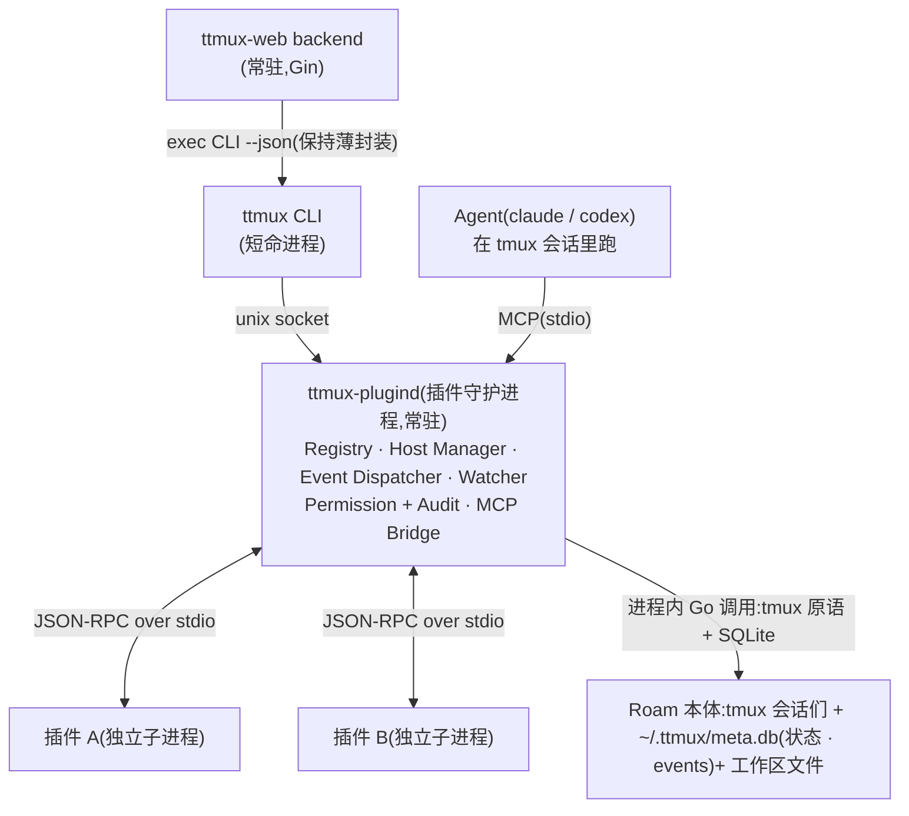

# Roam / ttmux 插件机制设计

> 状态: **设计草案 v2**　日期: 2026-07-03
>
> 目标: 允许第三方插件动态接入 Roam / ttmux,组织会话与 Agent(claude / codex),把它们串联成智能工作流,并做到可发现、可组合、可治理、可动态启停。

## 范围声明

- **v1 不涉及 swarm**。插件的扩展面是:命令、会话(session)、Agent、工作区、watcher、通知、finding。swarm 生命周期扩展点(hooks、Planner、Gatekeeper 等)整体后移,见 [08-roadmap.md](08-roadmap.md) 阶段 5。
- **插件的主体是后端进程,前端可选**:manifest 的 `main` 是一个由宿主拉起的后端程序(飞书消息插件就是典型的纯后端插件);设置界面由宿主按 config schema 自动渲染,自带 Web 面板是 v2 能力。详见 [04-architecture.md](04-architecture.md) 第 3 节。
- v1 的信任模型是"**安装即信任**"(与 VS Code 相同),权限声明用于展示、授权提示、宿主 API 侧约束和审计,**不构成对插件进程本身的运行时沙箱**。详见 [07-security.md](07-security.md)。

## 文档导航

| 文档 | 内容 |
|---|---|
| [01-research.md](01-research.md) | VS Code / JetBrains / Figma 插件机制调研与对比结论 |
| [02-product.md](02-product.md) | 产品定位、插件类型、用户旅程、治理分层 |
| [03-stories.md](03-stories.md) | 四个插件故事(去 swarm 化)、每个插件的具体形态、倒推的底层能力矩阵 |
| [04-architecture.md](04-architecture.md) | **核心**:宿主进程模型(plugind)、事件模型、RPC、与现有 CLI/Web/Agent 的集成、生命周期状态机 |
| [05-manifest.md](05-manifest.md) | manifest 规范、contribution points、activation events |
| [06-platform-api.md](06-platform-api.md) | 宿主暴露给插件的平台 API 面 |
| [07-security.md](07-security.md) | 信任模型、权限、威胁模型、审计 |
| [08-roadmap.md](08-roadmap.md) | 分阶段落地计划与 MVP |
| [09-plugin-development.md](09-plugin-development.md) | 插件开发指南:从 hello 到发布 |
| [10-feishu-concierge.md](10-feishu-concierge.md) | 飞书常驻管家 Agent(concierge):消息进大脑,复杂活开 worker |

相关文档:

- [智能评审插件设计.md](智能评审插件设计.md) — 插件机制的第一个消费者;其 manifest 与 finding 模型以本目录 [05-manifest.md](05-manifest.md) / [06-platform-api.md](06-platform-api.md) 为准对齐。

## 一页纸架构

完整全景图与全部通信通路见 [04-architecture.md](04-architecture.md) 第 2 节。

## 关键决策

| 决策 | 结论 | 依据 |
|---|---|---|
| 宿主进程归属 | 新增单例守护进程 `ttmux-plugind`,托管在专用 tmux 会话中,CLI/Web 按需拉起 | CLI 是短命进程,backend 与 CLI 之间是 exec 边界;watcher、事件订阅、常驻插件必须有常驻宿主。详见 [04-architecture.md](04-architecture.md) |
| 事件来源 | meta.db 追加式 `events` 表(写路径同步落事件)+ plugind 游标消费;session 生命周期由 plugind 轮询合成 | 现状没有事件总线,swarm/session 状态靠显式命令写 SQLite + 轮询。v1 诚实做"事件日志 + 游标",不假装有实时总线 |
| 插件描述格式 | JSON manifest(`roam-plugin.json`) | 与 VS Code/Figma 类似,易校验、易生成、易展示 |
| v1 运行时 | 协议语言无关(JSON-RPC over stdio,任意可执行文件);官方先提供 Node SDK | ttmux 是 Go 单二进制极简安装,不能把 Node 变成硬依赖 |
| 激活策略 | 默认惰性激活,超时 10s(可配) | 控制启动性能和风险 |
| 信任模型 | v1 安装即信任 + 声明式权限(展示/审计/宿主 API 约束);v2 容器/受限用户才谈 enforce | 普通子进程无法约束插件自身的命令执行与网络访问,不做虚假承诺 |
| Agent 调用插件 | plugind 内置 MCP 桥,把插件 `agentTools` 暴露为 MCP server | claude/codex 原生支持 MCP,无需自建 tool 协议 |
| 数据位置 | 配置与安装态进 `$TTMUX_HOME`(`~/.ttmux`:installed、secrets、meta.db 注册表),运行态进 `$TTMUX_DATA`(`~/.local/share/ttmux`:events.db、storage、logs、audit),socket 进 `$XDG_RUNTIME_DIR` | 与 runtime.go 既有的 HOME/DATA 双目录约定一致;高频事件日志与审计不进可备份的配置目录;注册表进 SQLite 避免多进程写 JSON 竞争 |
| swarm 扩展点 | v1 不做,阶段 5 引入 | 用户决策:插件先不涉及 swarm |
| 插件市场 | 后置 | 先打磨本地和组织插件机制 |
